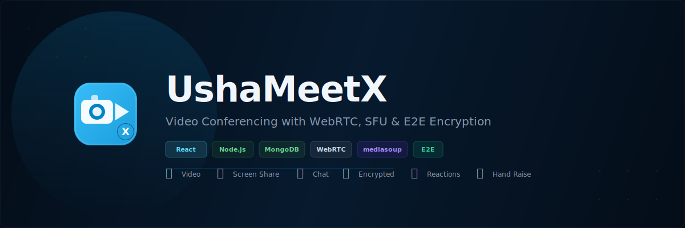

<div align="center">



Video conferencing app with hybrid P2P + SFU architecture and E2E encrypted chat.
<br/>Create a meeting, share the link, people join. No downloads needed.


</div>

---

## Features

| | Feature | |
|---|---|---|
| 🎥 | **HD Video** | WebRTC P2P + mediasoup SFU for group calls. Auto ICE restart on drops |
| 🖥️ | **Screen Share** | full screen or window, clean fallback |
| 🔒 | **E2E Chat** | AES-256-GCM, key lives in URL hash — server sees only ciphertext |
| 💬 | **Live Chat** | timestamps, typing indicator, auto-scroll, XSS sanitized |
| 👏 | **Reactions** | 👍👏❤️😂🎉🔥 floating emojis visible to everyone |
| ✋ | **Hand Raise** | animated wave badge on your tile |
| 📌 | **Spotlight** | pin anyone full-screen, rest in thumbnail strip |
| 🔊 | **Volume** | per-participant slider on hover |
| ⌨️ | **Shortcuts** | M V C H E for mute, camera, chat, hand, end |
| 📶 | **Network** | green/yellow/red from WebRTC RTT stats |
| 👤 | **Guest Join** | share link, no signup needed |
| 📱 | **Responsive** | works on mobile |

---

## Tech

| Frontend | Backend |
|---|---|
| React 18 + Router v6 | Express + Helmet |
| MUI v5 (dark theme) | mediasoup SFU (worker pool) |
| mediasoup-client | Socket.io (signaling + events) |
| WebRTC (`addTrack`/`replaceTrack`) | JWT + bcrypt auth |
| Axios (JWT interceptors) | Rate limiting (auth + socket) |
| DOMPurify + Web Crypto API | Winston logging |
| CSS Modules | MongoDB + Mongoose |

**32 tests** (Jest + node:test) · **GitHub Actions CI** · **Graceful shutdown**

---

## Quick Start

```bash
git clone https://github.com/AradhyaStuti/UshaMeetX-Full-Stack-WebRTC-Video-Conferencing-Platform.git
cd UshaMeetX-Full-Stack-WebRTC-Video-Conferencing-Platform
```

```bash
cd backend && cp .env.example .env && npm install && npm start    # localhost:8000
cd frontend && npm install && npm start                            # localhost:3000
```

Set `MONGO_URI` and `JWT_SECRET` in `backend/.env`. That's it for local dev.

---

## How it works

**SFU vs P2P** — backend tries to init mediasoup workers on startup. If it works, media routes through the server (scales to big groups). If not, falls back to P2P mesh (fine for 2-3 people). Frontend checks `/api/v1/sfu-status` and picks the right mode automatically.

**E2E Encryption** — chat messages encrypted with AES-256-GCM via Web Crypto API. The key is generated client-side and stored in the URL hash (`#`). Browsers never send the hash to the server, so the server only ever sees ciphertext. Green lock badge shows when active.

**Rooms** — `Map<path, Map<socketId, {username, avatar}>>` with reverse index for O(1) lookups. Chat capped at 200/room. Empty rooms auto-cleaned. Each room gets its own mediasoup Router in SFU mode.

---

## Structure

```
backend/src/
  app.js · controllers/ · models/ · routes/
  sfu/  config.js  worker.js  room.js
  utils/  jwt.js  logger.js

frontend/src/
  pages/  VideoMeet.jsx  landing  auth  home  history
  components/  ErrorBoundary  AvatarPicker  Logo
  utils/  sfuClient.js  encryption.js
  contexts/  AuthContext.jsx

.github/workflows/ci.yml
```

---

[@AradhyaStuti](https://github.com/AradhyaStuti)
